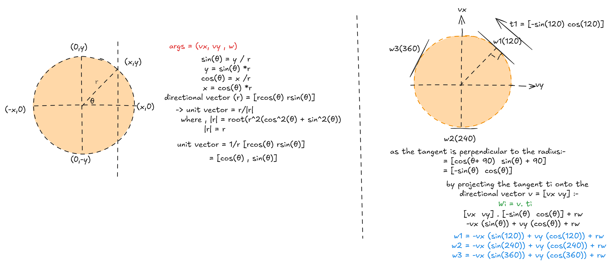
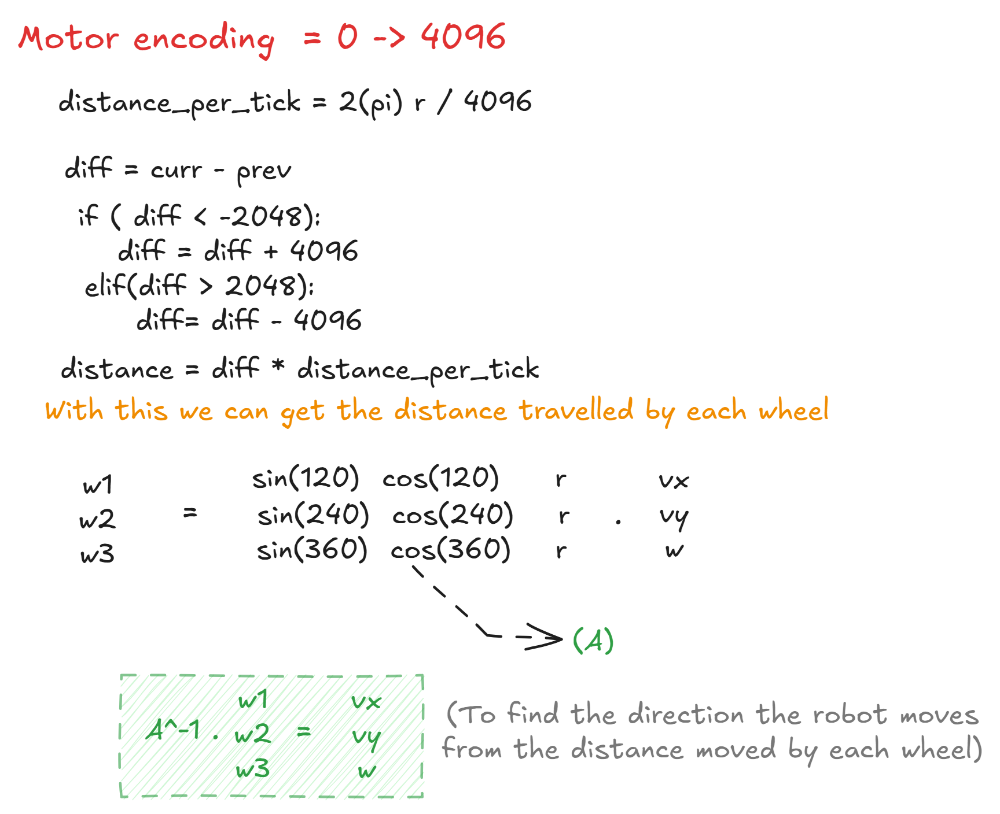
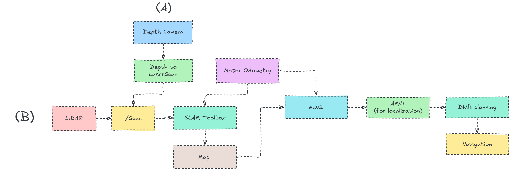
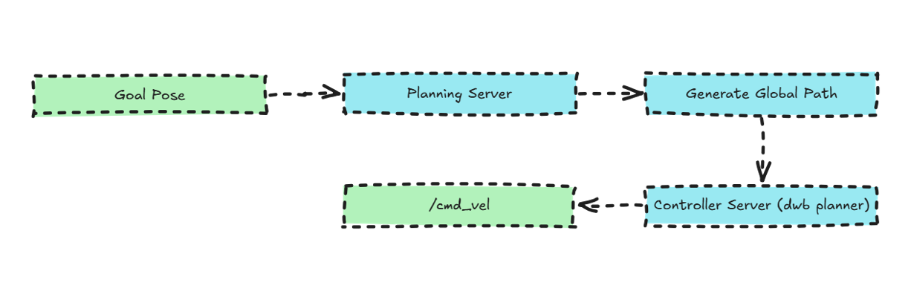
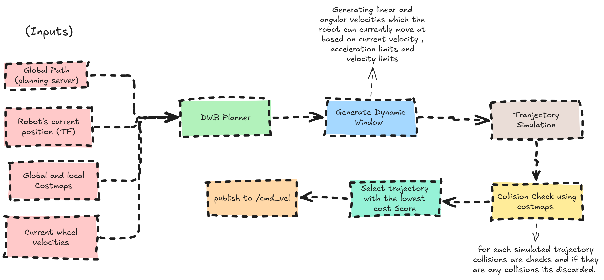

# Documentation to help understand more about Nav2 :-

## understanding Kinematics for Odometry :-

### Forword Kinematics

## Inverse Kinematics 

## Nav2 Workflow :-

The figure below illustrates the complete navigation pipeline for the Lekiwi Rover using either a Depth Camera or an RPLiDAR as the primary sensing device. When using a depth camera, the captured depth images are first converted into LaserScan data using a Depth-to-LaserScan node. For the LiDAR setup, the sensor directly publishes LaserScan messages. These scan data, together with the robot's motor odometry, are processed by SLAM Toolbox to generate a map of the environment. During navigation, the generated map and odometry are used by the Nav2 stack for localization through AMCL (Adaptive Monte Carlo Localization). The DWB (Dynamic Window Based) Planner then computes safe velocity commands for obstacle avoidance and path following, enabling the rover to autonomously navigate to its destination.

The figure below shows the internal workflow of the Nav2 navigation stack after a navigation goal is provided. A user-defined Goal Pose is first sent to the Planning Server, which computes a collision-free global path from the robot's current position to the destination. This global path is then passed to the Controller Server, which uses the DWB Local Planner to continuously calculate safe linear and angular velocity commands while considering the robot's surroundings. These velocity commands are published on the /cmd_vel topic, allowing the rover to follow the planned path and dynamically avoid obstacles until it reaches the goal.

## Dynamic Window Planning :-
The **Dynamic Window Approach (DWA)** is a local path planning algorithm used in Nav2 to safely move the robot toward its goal while avoiding obstacles. It works by generating several possible velocity commands, predicting the robot's motion for each one, and evaluating them based on factors such as obstacle avoidance, path following, and progress toward the goal. The command with the highest score is selected and sent to the robot. This allows the robot to react to changes in the environment in real time, making navigation smooth, safe, and efficient.

